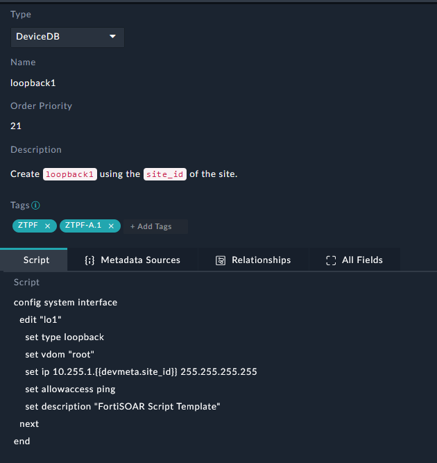
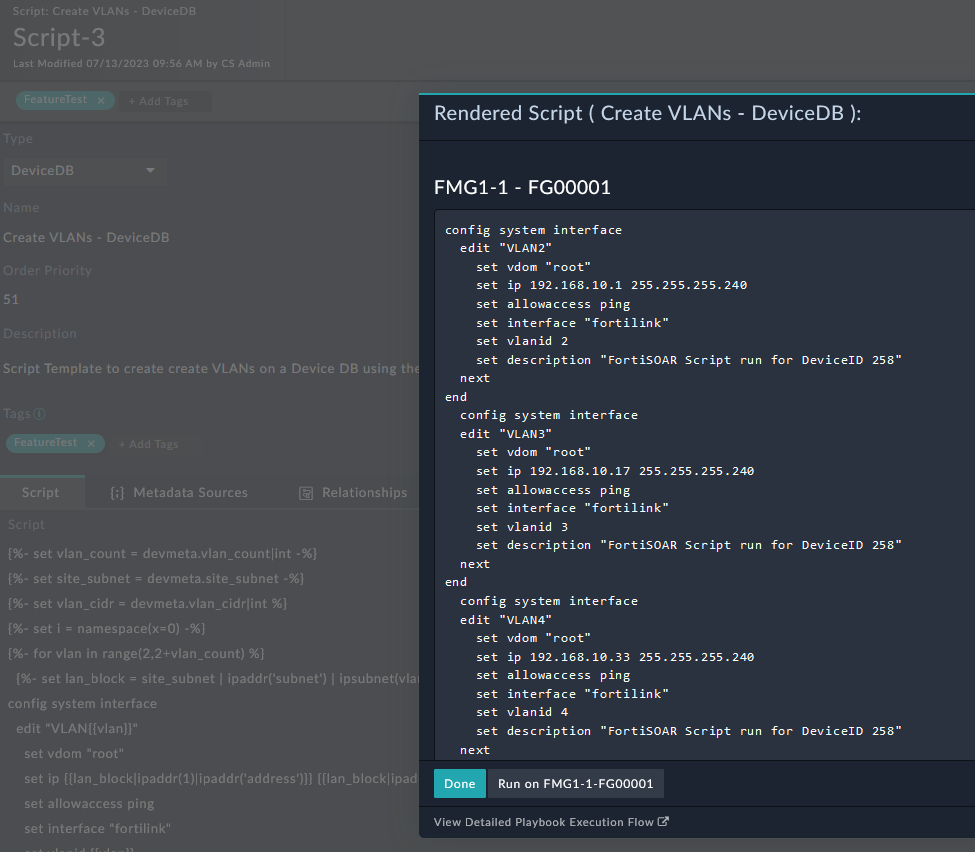

| [Home](../../README.md) / [Usage](../usage.md) |
|------------------------------------------------|

# Script Templates

## Script Types

| Type | Description | 
| ---- | ----------- |
| DeviceDB | Uses Jinja in FortiSOAR to create a DeviceDB script in the FMG, runs on the device, and then deletes the script from FMG when completed. | 
| PolicyDB | Uses Jinja in FortiSOAR to create a PolicyDB script in the FMG, runs on the Policy Package assigned to the device, and then deletes the script from FMG when completed. | 
| Remote CLI | Uses Jinja in FortiSOAR to create a Remote CLI script in the FMG, runs on the device, and then deletes the script from FMG when completed. |
| Remote TCL | Uses Jinja in FortiSOAR to create a Remote TCL script in the FMG, runs on the device, and then deletes the script from FMG when completed. |
| Provisioning CLI Template | Uses Jinja in FortiSOAR to create a Provisioning CLI script in the FMG and associates it to this device using the Provisioning Template Group defined in this device. | 
| Provisioning Jinja Template | Creates a Provisioning Jinja script in the FMG and associates it to this device using the Provisioning Template Group defined in this device. FortiSOAR will **not render the Jinja** as these are Jinja scripts that should be rendered by FMG. |
| Report Markdown | Creates a locally hosted report output that gets appended to the `Report Markdown` field on the [Device](./devices.md) record.  | 
| Custom | Custom scripts are designed to control the device record in FortiSOAR as well as kickoff any Metafield Sources that can be used to leverage any custom script. | 

## Example Jinja Rendered CLI Template

Templates can be as simple as creating a config block and can be used to create CLI output with `DeviceDB`, `PolicyDB`, `Remote CLI`, and `Remote TCL` script types. 



Script Templates can also be full Jinja scripts to build a more complicated configuration.

```





  
config system interface
  edit "VLAN{{vlan}}"
    set vdom "root"
    set ip {{lan_block|ipaddr(1)|ipaddr('address')}} {{lan_block|ipaddr('netmask')}}
    set allowaccess ping
    set interface "fortilink"
    set vlanid {{vlan}}
    set description "FortiSOAR Script run for DeviceID {{record.id}}"
  next
end
  

```



## Custom Script Data

Custom scripts need to output a JSON to indicate what should be done to the device record. You can leverage the [Metafield Sourced](../usage/jinja_rendering_with_metafield_sources.md)

```


{{idx}}
```